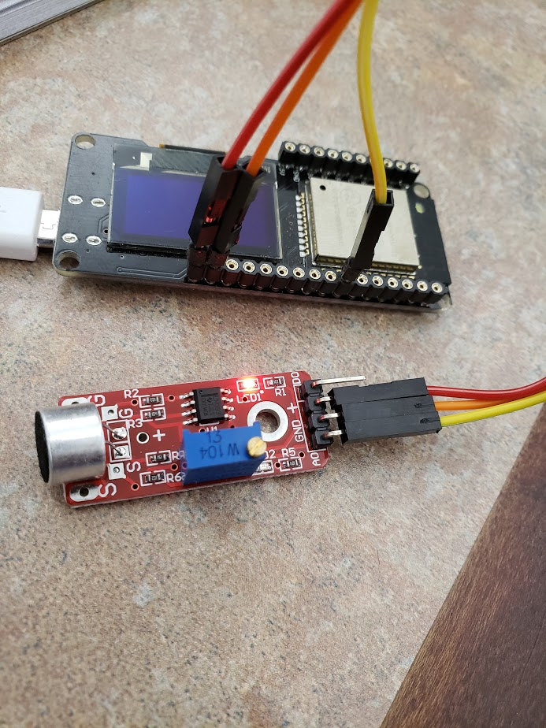

# Woof Alert™

Keep your home safe. Woof Alert™ is a special dog collar that sends you email alerts whenever your dog barks. By leveraging the power of the ESP32 and state of the art sound detection modules, Woof Alert™ puts _you_ in control.


# Are You Serious?

Nope. Lighten up.

# Installation - Software

To get started, clone this repo:

````
git clone https://github.com/FoxDotBuild/woof-alert.git
cd woof-alert
````

Next, you will need to create a `secrets.h` file for storing your WiFi passwords:

```
cp secrets.example.h deleteme.h
```

Open `secrets.h` with a text editor and enter the appropriate values.
**Nothing will work if you skip this step.**

# Installation - Hardware

After flashing the firmware to the device, hook up a [sound detection module](https://www.amazon.com/Detection-Intelligent-Compatible-Atomic-Market/dp/B00TM7R21W) to pin 14 of your ESP32.

Here's how I did it:



# Deployment

Cut a tube and insert the ESP, microphone and a small USB power bank. Attach the tube to a standard collar, making sure that there are no exposed wires or uncomfortable pokey things that might annoy your doggo.

Half inch PVC pipe works great on large breed dogs, such as the Golden Retriever shown above.

EXTRA CREDIT: Add a toggle switch to the case to allow for easy disarmament when you are home.
